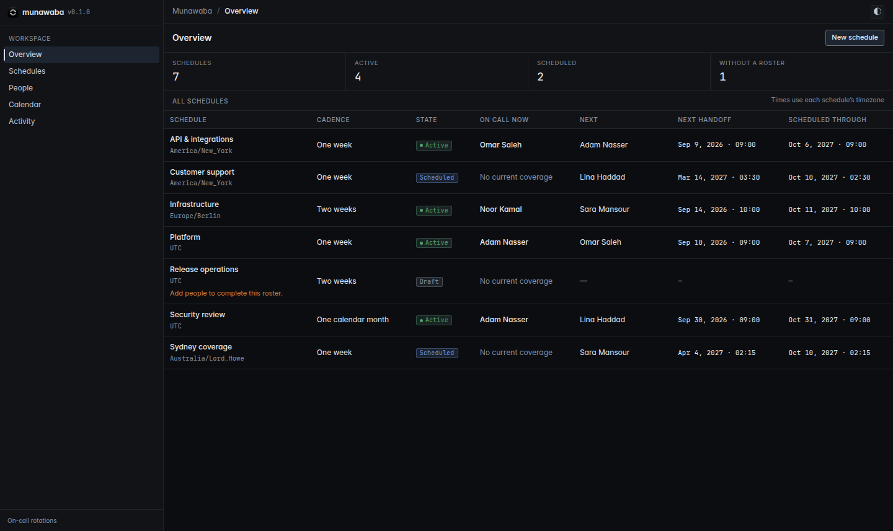
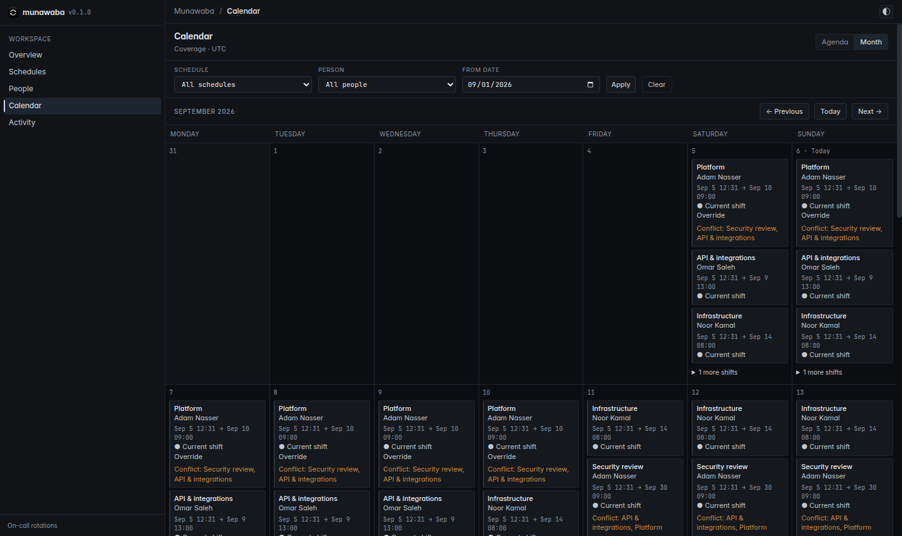

<p align="center">
  
</p>

<h1 align="center">Munawaba</h1>

<p align="center">
  <a href="LICENSE.txt"></a>
  <a href="#requirements">= 3.4"></a>
  <a href="#requirements"></a>
  <a href="#requirements">= 15"></a>
</p>

<p align="center">
  <strong>On-call rotations inside your Rails application.</strong>
</p>

Munawaba helps your team share on-call duty. Build a rotation, see who's on call, and cover a teammate's shift when plans change. Connect Slack to announce handoffs and assignment changes.

## Table of Contents

- [Requirements](#requirements)
- [Installation](#installation)
- [Dashboard](#dashboard)
- [Background Jobs](#background-jobs)
- [Scope](#scope)
- [Documentation](#documentation)
- [Contributing](#contributing)
- [License](#license)

## Requirements

- Ruby 3.4+
- Rails 8.1
- PostgreSQL 15+

See the [compatibility matrix](CONTRIBUTING.md#compatibility-and-ci) for tested combinations.

## Installation

Add Munawaba to your host application's Gemfile:

```ruby
gem "munawaba"
```

```sh
bundle install
bin/rails generate munawaba:install
```

The generator creates an initializer and copies the migrations. For an existing installation, follow [upgrading](docs/usage.md#upgrading).

Mount the dashboard:

```ruby
# config/routes.rb
mount Munawaba::Engine => "/on-call"
```

Configure access using your application's authentication and authorization. This example uses `authenticate_user!` and `current_user`:

```ruby
# config/initializers/munawaba.rb
Munawaba.configure do |config|
  config.authenticate = ->(controller) do
    controller.send(:authenticate_user!)
    controller.current_user.present?
  end
  config.authorize = ->(controller, _action, _record) { controller.current_user.admin? }
  config.actor = ->(controller) do
    user = controller.current_user
    { type: "User", id: user.id.to_s, name: user.name }
  end
  config.application_base_url = "https://example.com/on-call"
  config.notifications_enabled = false
end
```

Access is denied until both callbacks are configured to return `true`. The optional `actor` callback identifies who made each change in Activity. See [access](docs/usage.md#access) and [configuration](docs/usage.md#configuration) for the full reference.

```sh
bin/rails db:migrate
```

The migration enables `btree_gist` automatically for shift overlap checks. If it is missing and your database restricts extension creation, ask your database administrator to enable it first.

Follow [Slack setup](docs/usage.md#slack-notifications) to enable notifications and send your first test message.

## Dashboard

Open `/on-call` in your host application after installation. The dashboard provides:

- People and ordered rotations with one-week, two-week, or calendar-month schedules.
- Current coverage, upcoming handoffs, and agenda or month calendars.
- Previews before activation, rotation changes, and whole-shift overrides, including cross-schedule conflict warnings.
- Activity history and per-schedule Slack settings and delivery history.

### Overview

<picture>
  <source media="(prefers-color-scheme: dark)" srcset="docs/screenshots/overview-dark.png">
  <source media="(prefers-color-scheme: light)" srcset="docs/screenshots/overview-light.png">
  
</picture>

### Calendar

<picture>
  <source media="(prefers-color-scheme: dark)" srcset="docs/screenshots/calendar-dark.png">
  <source media="(prefers-color-scheme: light)" srcset="docs/screenshots/calendar-light.png">
  
</picture>

See [using the dashboard](docs/usage.md#dashboard) for roster changes, previews, and calendars.

## Background Jobs

Schedule these two jobs using your host's Active Job adapter and recurring scheduler. All jobs use `job_queue_name`.

| Frequency    | Job                               | Work                                                                                              |
| ------------ | --------------------------------- | ------------------------------------------------------------------------------------------------- |
| Every minute | `Munawaba::MaintenanceJob`        | Apply scheduled starts and pauses, recover interrupted deliveries, and dispatch due notifications |
| Daily        | `Munawaba::MaintainProjectionJob` | Refresh future timings and extend scheduled coverage                                              |

With [GoodJob](https://github.com/bensheldon/good_job#cron-style-repeatingrecurring-jobs), add these entries to your cron configuration:

```ruby
# config/initializers/good_job.rb
Rails.application.configure do
  config.good_job.cron = {
    munawaba_maintenance: { cron: "* * * * *", class: "Munawaba::MaintenanceJob" },
    munawaba_projection: { cron: "0 0 * * *", class: "Munawaba::MaintainProjectionJob" }
  }
end
```

Start the worker with cron enabled:

```sh
bundle exec good_job start --enable-cron
```

See [maintenance](docs/usage.md#maintenance) for troubleshooting and timezone-data updates.

## Scope

Munawaba manages on-call schedules for one workspace. Overrides cover a whole shift, and conflicts between schedules appear as warnings for you to review.

## Documentation

[Usage and reference](docs/usage.md) covers scheduling, access, configuration, Slack delivery, and maintenance. See the [changelog](CHANGELOG.md) for releases.

## Contributing

See [CONTRIBUTING.md](CONTRIBUTING.md) for the local demo, development setup, and test commands. Report security issues as described in [SECURITY.md](SECURITY.md).

## License

[MIT License](LICENSE.txt).
